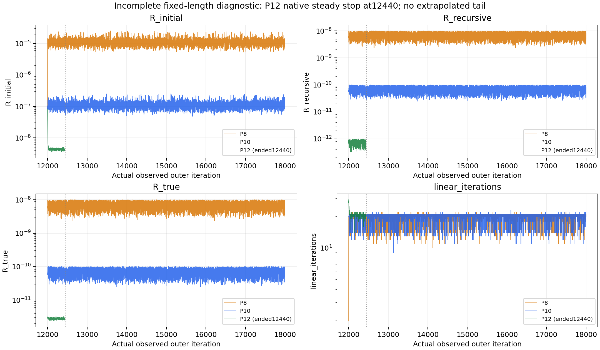
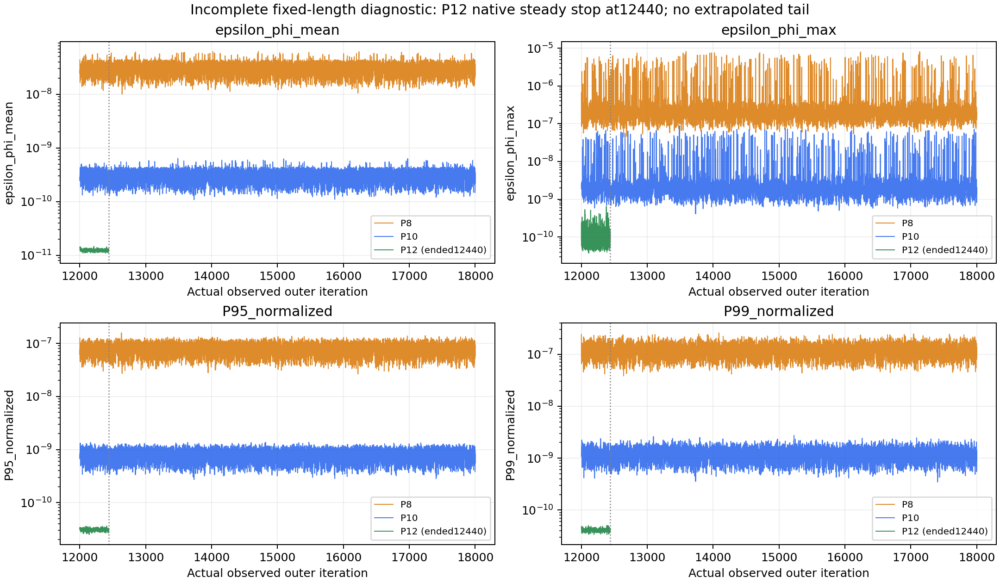
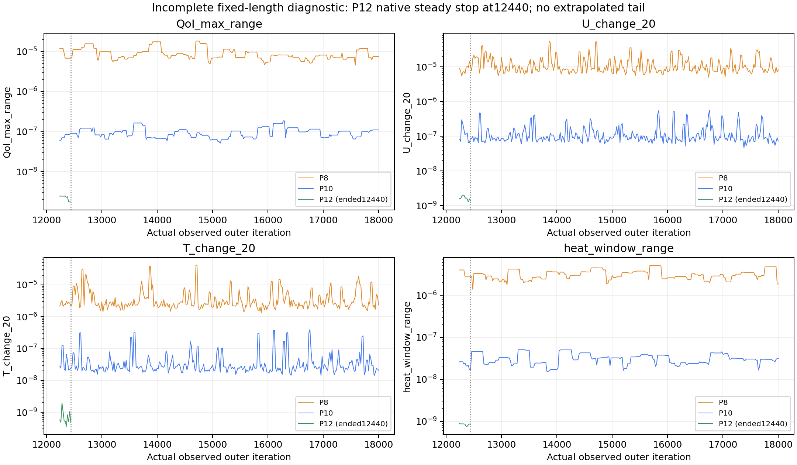
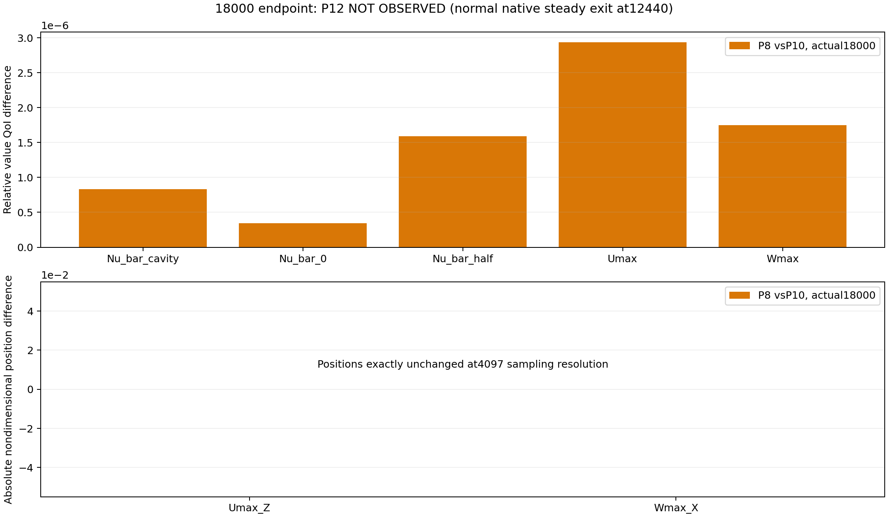

# Pressure-Tolerance Single-Factor Diagnostic

**STOP — P12は元native steady monitorにより12440で正常自動終了した。** 指定した12000→18000連続区間は未完了なのでexecution protocol上P12=FAIL、linear solver infeasible/fatalではない。15000–18000のP12 late dataと18000 field/QoIは未取得。禁止されたmonitor変更・restart・代替toleranceは実行していない。主effect/monotonicity/primary-cause判定は登録どおりINCONCLUSIVE。

## 1. Purpose

20²/zero-source/Ra_test30000 のpressure linear-solve precisionだけをfactorとするcoupled solver sensitivity。PrimaryはP12 vsP10、P8は方向性診断。Diagnostic PASSは単一factor実験の成立を意味する。Scientific acceptanceやGate threshold、steady基準は変更していない。

## 2. Previous convergence and restart evidence

元baselineは12000→30000でも1e-8条件未達。QoI/heatのlate variationはPLATEAU、U/TはINCONCLUSIVE。Restart experimentでは15000追加restartの軌道差を検出したが、continuous CにもO(1e-7) bandが残り、additional restart必要条件NOT_SUPPORTED、primary causeINCONCLUSIVE。今回は途中restartを行わない。これらは独立microcaseの既存evidenceのみ。

## 3. Amendment and hashes

Solver前に固定：JSON `c6feb4ad53dcd2704f6ad157b7ba13582a8a968f054ee30907efa16e084a2e5b`、MD `2ee964051c919d73e0da212aa2320909b268643a488aec056f9f03035ff8e78e`。開始HEAD `3095039ec002b288a0c4000f9ccc788761cb0048`。Startup/preflight/diff/scatter/source/method digestを保存し、各call前と分析後に確認。元v1/amendments001/002、以前の全成果物不変。git add/commit/push未実施。start/end status/diffをpressure_tolerance_provenance.jsonに保存。最終tracked diffは空。verification_checks.jsonに検証結果を保存。

## 4. Common 12000 parent

既存qualificationと同じ完全12000 tree、U/T/p_rgh/phi/alphat/p/uniform/timeのSHA256一致。mesh/physical properties/fvSchemes等inputs/solver binaryも照合。元fieldは不変。全branchへ同一stateをcopy。

| field | sha256 |
| --- | --- |
| U | 1e319f4661afed3992a6be31f954effd3b7a49582e5552380063da01995349fe |
| alphat | e29fe1c6dddb9eb38423349801b4d71a8ae5f21aa25d800bc26798fbd46f12db |
| phi | b221f60d0bcd87a4f684f530cd619ed0c31ae1d21c02341e695ee14f5c7f6801 |
| T | ba8484010268a9dae6c869a4cc20fe28f16a47855a1b763fbee0d402201c28f3 |
| p | 9a08968b558df1d5d259c2642c6e722d8bfbefc5b18f7dac3fa22baeb20d3725 |
| p_rgh | f22af178a878ad88fca991483f8aac68f9af46171ee69332f80cfc41628a3dc3 |
| uniform/time | 906fbe54ab7952035b4fca38bf552537e5329585befa9faaa3e8834b5a930d5d |

## 5. Single-factor design

順序P10(1e-10)→P8(1e-8)→P12(1e-12)、pressure relTol0。各branchは12000→18000単一process、serial DP、途中restartなし。U/T tolerance1e-12、relTol0、PCG/DIC/maxIter10000、relaxation、SIMPLE、scheme、mesh、physics、BC、source、source/binary、QoI/monitor/steady criteria不変。

P12 preflight: installedv6 sourceは1e-12を拒否しないが、既存Case Cは1e-10まででfeasibility/floor未確定。norm drift/reference/physical mappingの不確かさを認識し、true residualを保存。1e-11へ代替しない。feasibility_preflight.json参照。

## 6. Input equivalence

Machine-checkでbranch間diffがsystem/fvSolution.solvers.p_rgh.tolerance tokenだけであることを確認し、unified diffと全hashをinput_diff_audit.jsonへ保存。Copied controlDictのstartFrom/latestTimeとendTime18000は全branch共通。auditPressureToleranceは1e-10に固定し、nativecontinuity stability criterionを変えていない。case_manifest.jsonはparent provenanceとしてbyte-identicalに保持し、branch実toleranceを別manifest/JSONに明記。

Solver binary SHA256 `b3696687e1fbea626916c857215e0654a0c7b710a6a8115811486af1afe7c904`。

## 7. Branch execution

| branch | tolerance | status |
| --- | --- | --- |
| P8 | 1.0000000e-08 | PASS |
| P10 | 1.0000000e-10 | PASS |
| P12 | 1.0000000e-12 | FAIL |

P10_CONTROL_REPRODUCIBILITY=PASS。Existing continuous C18000の4 raw/payload SHAと比較し、PASSを次branchのgateに使用。各processのPID、開始終了timestamp、hostname、Foundationversion/DP、environment digest、load average、input/binary前後hash、連続iteration列を保存。STOP=STOP: original native monitor confirmed steady and terminated P12 normally at12440. Reaching18000 would require prohibited stop-behavior change or restart; no further solver execution.。途中restart/retry/追加solver callなし。


P12のexit code=0、EndおよびSENSITIVITY_STEADY_CONFIRMEDを確認。440 pressure solvesすべてconverged=true、14–29 linear iterations、maxIter到達・stall・NaN/Inf/fatalなし。元native criteriaは12240から12440の11 samplesでqualifyし、全11 samplesでUx/Uy/Tinitial<=1e-8、p final<=1.1*actual1e-12も満たした。さらに12240–12440の全201反復でUx/Uy/Tinitial<=1e-8を確認した。200反復の追加confirmationが成立。P12はbaseline acceptedとはしておらず、Arm1/Arm2も再開しない。Native自動停止を上書きすることは今回許可されていない。

Post-STOP supplemental analysisは未登録late区間を代用しないbookkeeping。別source digestと作成時点をprovenanceへ記録。

## 8. Pressure residual response

| branch | metric | min | median | max | P95 | samples |
| --- | --- | --- | --- | --- | --- | --- |
| P8 | R_initial | 5.4519094e-06 | 1.0956837e-05 | 1.8267344e-05 | 1.4583008e-05 | 151 |
| P8 | R_recursive | 3.2178138e-09 | 6.9004756e-09 | 9.9161222e-09 | 9.4339052e-09 | 151 |
| P8 | R_true | 3.2177317e-09 | 6.9004137e-09 | 9.9160291e-09 | 9.4340355e-09 | 151 |
| P8 | linear_iterations | 1.3000000e+01 | 2.0000000e+01 | 2.1000000e+01 | 2.1000000e+01 | 151 |
| P10 | R_initial | 6.0740740e-08 | 1.1152636e-07 | 2.2061998e-07 | 1.6121214e-07 | 151 |
| P10 | R_recursive | 3.2227449e-11 | 7.1345261e-11 | 9.9882893e-11 | 9.6750354e-11 | 151 |
| P10 | R_true | 3.2113007e-11 | 7.1304006e-11 | 9.9592257e-11 | 9.6721045e-11 | 151 |
| P10 | linear_iterations | 1.1000000e+01 | 2.0000000e+01 | 2.3000000e+01 | 2.1000000e+01 | 151 |

全iterationのpressure/Ux/Uy/Uz/T initial/final/countをpressure_residuals.csvに保存。Pressure統計はnative audit17digitsを使い、logの表示precisionと区別。True residualはrecursive residualと同一とは仮定しない。



## 9. Continuity response

| branch | metric | min | median | max | P95 | samples |
| --- | --- | --- | --- | --- | --- | --- |
| P8 | epsilon_phi_mean | 1.4092866e-08 | 3.0486157e-08 | 5.2896329e-08 | 4.2531356e-08 | 151 |
| P8 | epsilon_phi_max | 8.1189261e-08 | 2.0956940e-07 | 6.9593301e-06 | 4.6026711e-07 | 151 |
| P8 | P95_normalized | 3.5230451e-08 | 8.2033756e-08 | 1.2948715e-07 | 1.1668755e-07 | 151 |
| P8 | P99_normalized | 4.6050530e-08 | 1.2406057e-07 | 2.4053614e-07 | 1.8482956e-07 | 151 |
| P10 | epsilon_phi_mean | 1.3974155e-10 | 3.1210946e-10 | 4.7439436e-10 | 4.2873300e-10 | 151 |
| P10 | epsilon_phi_max | 5.8185829e-10 | 2.0297494e-09 | 3.6741006e-08 | 4.0672571e-09 | 151 |
| P10 | P95_normalized | 3.2165818e-10 | 8.4317653e-10 | 1.2822537e-09 | 1.1409848e-09 | 151 |
| P10 | P99_normalized | 5.0702246e-10 | 1.2464560e-09 | 2.1774653e-09 | 1.8137477e-09 | 151 |

Max/mean、global signed、cell-boundary closure、Up、net boundary fluxを全iterationに保存。Boundary absolute leakageとfield continuityは各final JSONにも保存。epsilon thresholdをpressure toleranceと等置しない。




P12の以下は早期停止checkpointの単一時点（late統計ではない）：

| metric | P12_at_12440 |
| --- | --- |
| R_initial | 4.1975721e-09 |
| R_recursive | 3.7715638e-13 |
| R_true | 2.8146356e-12 |
| linear_iterations | 2.1000000e+01 |
| epsilon_phi_mean | 1.2285709e-11 |
| epsilon_phi_max | 1.2791697e-10 |
| QoI_max_range | 1.7609553e-09 |
| U_change_20 | 1.3584547e-09 |
| T_change_20 | 4.6895821e-10 |
| U_window_max | 2.0064877e-09 |
| T_window_max | 1.9688287e-09 |
| heat_window_range | 8.6748155e-10 |
| heat_imbalance | 2.7767185e-10 |

## 10. QoI variation response

| branch | metric | min | median | max | P95 | samples |
| --- | --- | --- | --- | --- | --- | --- |
| P8 | QoI_max_range | 4.5386132e-06 | 7.2209077e-06 | 1.1888020e-05 | 1.1629945e-05 | 151 |
| P10 | QoI_max_range | 5.1535050e-08 | 1.0186487e-07 | 1.8512137e-07 | 1.5964472e-07 | 151 |

全7QoI値と個別window range、position range、元nativequalified flagをvariation_band.csv、12000/13000/.../18000をcheckpoints.csvに保存。Late intervalは事前登録15000–18000 inclusive、20刻み151samples、window200/11samples。First12020 restart sentinelはlate intervalへ混入しない。

## 11. U/T field variation response

| branch | metric | min | median | max | P95 | samples |
| --- | --- | --- | --- | --- | --- | --- |
| P8 | U_change_20 | 5.0390998e-06 | 8.7736729e-06 | 3.5941939e-05 | 2.9627540e-05 | 151 |
| P8 | T_change_20 | 1.3169381e-06 | 2.5134078e-06 | 1.8209914e-05 | 1.2185779e-05 | 151 |
| P8 | U_window_max | 9.2753889e-06 | 2.2165129e-05 | 3.5941939e-05 | 3.5941939e-05 | 151 |
| P8 | T_window_max | 2.6132991e-06 | 8.6906674e-06 | 1.8209914e-05 | 1.8209914e-05 | 151 |
| P10 | U_change_20 | 4.6419447e-08 | 9.0231722e-08 | 5.6409496e-07 | 4.0998429e-07 | 151 |
| P10 | T_change_20 | 1.4192722e-08 | 2.5734948e-08 | 3.9585251e-07 | 2.7327184e-07 | 151 |
| P10 | U_window_max | 1.0187896e-07 | 3.9190776e-07 | 5.6409496e-07 | 5.6409496e-07 | 151 |
| P10 | T_window_max | 2.7748627e-08 | 9.2127266e-08 | 3.9585251e-07 | 3.9585251e-07 | 151 |

Primaryはnormalized20-step field changeのlate中央値/P95。元steady criterionで使うwindow maxも別保存し、これらを同じ統計として混同しない。Uはnative currentUp、TはDeltaT1K。Full written fieldsを外部archiveし、write/purge設定を変えずprocessを継続。

## 12. Heat-balance response

| branch | metric | min | median | max | P95 | samples |
| --- | --- | --- | --- | --- | --- | --- |
| P8 | heat_imbalance | 5.2388650e-08 | 1.2387914e-06 | 5.3330033e-06 | 3.4573595e-06 | 151 |
| P8 | heat_window_range | 1.8544910e-06 | 2.9680494e-06 | 5.1187660e-06 | 5.1187660e-06 | 151 |
| P10 | heat_imbalance | 3.7034482e-11 | 1.2635214e-08 | 4.6984089e-08 | 3.2883636e-08 | 151 |
| P10 | heat_window_range | 1.6285627e-08 | 3.0358036e-08 | 4.5301224e-08 | 4.2377409e-08 | 151 |

各branchの元steady評価：

```json
{
  "P10": {
    "native_qualified_sample_count": 0,
    "all_original_criteria_sample_count": 0,
    "compiled_200_iteration_confirmation_marker": false,
    "baseline_accepted": false,
    "capacity_audit_pressure_tolerance": 1e-10,
    "residual_rule": "unchanged functional rule Ux/Uy/T initial<=1e-8; p final<=1.1*actual branch tolerance"
  },
  "P8": {
    "native_qualified_sample_count": 0,
    "all_original_criteria_sample_count": 0,
    "compiled_200_iteration_confirmation_marker": false,
    "baseline_accepted": false,
    "capacity_audit_pressure_tolerance": 1e-10,
    "residual_rule": "unchanged functional rule Ux/Uy/T initial<=1e-8; p final<=1.1*actual branch tolerance"
  }
}
```

Native capacity parameter1e-10は不変。式residual条件は元functional rule、U/Tinitial<=1e-8・p final<=1.1*branch自身のtolerance。Baseline acceptedやArm再開には使わない。



## 13. Pressure residual to epsilon mapping

| branch | metric | min | median | max | P95 | samples |
| --- | --- | --- | --- | --- | --- | --- |
| P8 | Np | 2.2361841e-07 | 2.2362048e-07 | 2.2362192e-07 | 2.2362114e-07 | 151 |
| P8 | Kp | 4.3596207e+00 | 4.3596602e+00 | 4.3596855e+00 | 4.3596707e+00 | 151 |
| P8 | ratio_recursive | 9.8130600e-01 | 1.0039646e+00 | 1.4884007e+00 | 1.0310842e+00 | 151 |
| P8 | ratio_true | 9.8132287e-01 | 1.0039575e+00 | 1.4883821e+00 | 1.0310378e+00 | 151 |
| P10 | Np | 2.2362045e-07 | 2.2362046e-07 | 2.2362048e-07 | 2.2362047e-07 | 151 |
| P10 | Kp | 4.3596622e+00 | 4.3596625e+00 | 4.3596629e+00 | 4.3596627e+00 | 151 |
| P10 | ratio_recursive | 9.8258517e-01 | 1.0063169e+00 | 1.2361354e+00 | 1.0236147e+00 | 151 |
| P10 | ratio_true | 9.8263942e-01 | 1.0037305e+00 | 1.2354454e+00 | 1.0221701e+00 | 151 |

Kp= L*Np/(Up*Vtotal)。epsilon/(Kp R_final)とepsilon/(Kp R_true)、reference residual、physical mapping L1/max、norm driftをmapping_diagnostics.csvへ保存。Solver reported normalized residualにはreference/recursion/physical mappingの差があり、単純な等式・普遍floorを保証しない。1e-12 solve≠epsilon<=1e-12。

## 14. Monotonicity

| metric | P12_over_P10 | P8_over_P10 | monotonicity |
| --- | --- | --- | --- |

Overall descriptive median response=INCONCLUSIVE。Tighteningで増える量も削除しない。Raw median orderとresolved effectを分離：事前固定15 non-overlapping200-iteration block mediansのenvelope非重複、かつ既存C/R中央値差proxy超過を要件とする。Envelopeはconfidence intervalではなく、prior restart差はIID repeatabilityでもない。各量のmin/median/max/P95、block medians、重複判定を保存。Cutoffの後付け変更なし。

```json
{}
```


利用可能なP8/P10 late median ratios（P12/P10は欠測）：

| metric | P8_over_P10 | P12_over_P10 |
| --- | --- | --- |
| R_recursive | 9.6719467e+01 | null |
| epsilon_phi_mean | 9.7677773e+01 | null |
| epsilon_phi_max | 1.0324891e+02 | null |
| QoI_max_range | 7.0887121e+01 | null |
| U_change_20 | 9.7234905e+01 | null |
| T_change_20 | 9.7665159e+01 | null |
| heat_window_range | 9.7768161e+01 | null |

P8は各主要bandとepsilonをP10より大きくした。この2水準の結果は解析可能だが、P12欠測を補って3水準response/effect分類には使わない。

## 15. Final field differences

| branch | field | max_abs_difference | RMS_difference | normalized_max_difference | normalized_RMS_difference |
| --- | --- | --- | --- | --- | --- |
| P8 | U | 2.9946575e-08 | 9.9020577e-09 | 5.8383280e-06 | 1.9304866e-06 |
| P8 | T | 1.6774824e-06 | 5.0040921e-07 | 1.6774824e-06 | 5.0040921e-07 |
| P8 | p_rgh | 5.2848287e-10 | 1.4806350e-10 | 9.3597914e-06 | 2.6223054e-06 |
| P8 | phi | 6.1224732e-15 | 1.9354012e-15 | 2.3872517e-06 | 7.5464436e-07 |

Internal+physical boundary値の比較。U vector norm、scalar absolute difference。Scalesはcommon12000から事前固定（amendment002と同じ）、pressure gradientは別unitsで保存しRMSへ混ぜない。raw/payload hashとinternal-only/L1もCSV。

| branch | qoi | P10_value | branch_value | absolute_difference | relative_difference |
| --- | --- | --- | --- | --- | --- |
| P8 | Nu_bar_cavity | 3.2919556e+00 | 3.2919529e+00 | 2.7431611e-06 | 8.3329224e-07 |
| P8 | Nu_bar_0 | 3.2754301e+00 | 3.2754312e+00 | 1.1284980e-06 | 3.4453428e-07 |
| P8 | Nu_bar_half | 3.2754300e+00 | 3.2754248e+00 | 5.2116494e-06 | 1.5911344e-06 |
| P8 | Umax | 2.4452104e+01 | 2.4452032e+01 | 7.1790112e-05 | 2.9359483e-06 |
| P8 | Wmax | 3.6249847e+01 | 3.6249911e+01 | 6.3479790e-05 | 1.7511740e-06 |
| P8 | Umax_Z | 8.2519531e-01 | 8.2519531e-01 | 0.0000000e+00 | 0.0000000e+00 |
| P8 | Wmax_X | 7.4951172e-02 | 7.4951172e-02 | 0.0000000e+00 | 0.0000000e+00 |

値QoIはP10基準relative、position primaryはabsolute nondimensional。4097位置samplingの不変からpeak exact不変を主張しない。Formal paper値なし。




P12の18000 field/QoI差はNOT_OBSERVED。P8/P10のみの実測比較を掲載。P12_at_12440.jsonとearly_stop_diagnostics.jsonは正常終了時のstateを保持し、P12_vs_P10_12440.csvは同時点のsupplemental比較（主endpointの代替ではない）。

## 16. Interpretation

Pressure tolerance effect=INCONCLUSIVE。Pressure precision as primary band cause=INCONCLUSIVE。QoI/U/T band contributor=INCONCLUSIVE。圧力residual/continuity変化とouter variation変化を別に評価し、単なるendpoint差をband縮小とみなさない。非単調なmedianとscatterに対して未解像な差を保持。Original1e-8基準を緩めていない。P8/P10は6000反復、P12は440反復で正常自動終了。Prespecified late dataが欠けるので、primary因果・寄与率への過大解釈を避ける。

## 17. What is NOT concluded

Pure continuity effect、true/exact solution、圧力tolerance=epsilon threshold、普遍的roundoff floor、scientific quota/tau/Gate threshold、新steady基準、他Ra/grid、formal Gate再評価、Candidate B正式採用、U/T precisionやrelaxationの原因確定は結論しない。P12の悪化/非単調性からroundoff/inner iterations/SIMPLE nonlinear sensitivityのどれかを断定しない。Formal結果/fields/logsは使用していない。

## 18. Next decision

このtaskで停止。まず別taskで、元steady criteriaを保ちながら固定長診断を続ける停止制御を許容するか、confirmation時終了を含む比較設計に改めるかを決める必要がある。Amendment003や元monitor/binaryをこのtaskで変更せず、P12をrestart/再実行していない。早期終了を理由にp tolerance1e-11等の代替値も試していない。

Pressure studyを解決した後のfactor候補はUまたはT absolute tolerance単独（同時変更せず、relaxation固定）。今回のP12早期縮小はpressure contributionの有望な補足証拠だが、登録したlate比較のSTRONG_EFFECT/primary causeへ昇格させない。Arm1/Arm2再開なし、quota/tauUNRESOLVED、Candidate B PROVISIONAL、formalRa1e3GateGFAILは従来状態の宣言、SPEC_CHANGE_EXECUTED=NO、USER_DECISION_REQUIRED=YES。
