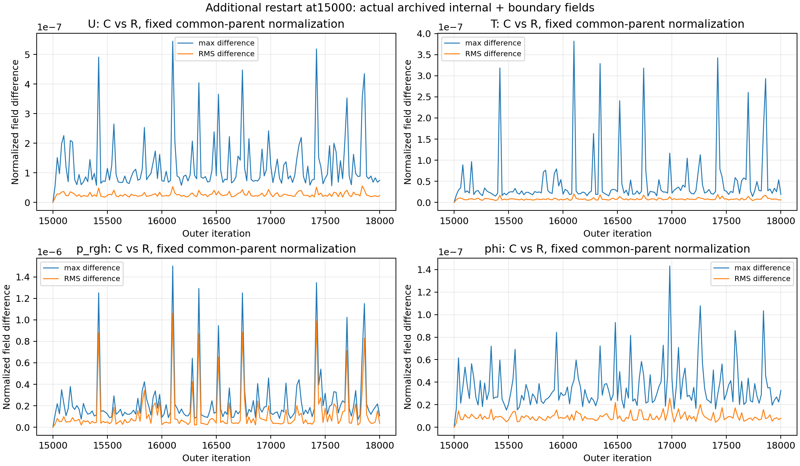
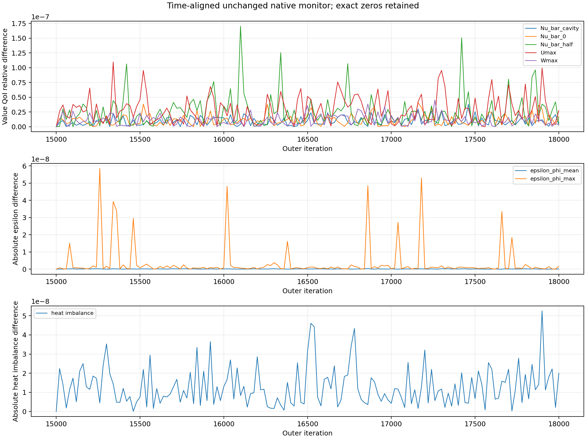
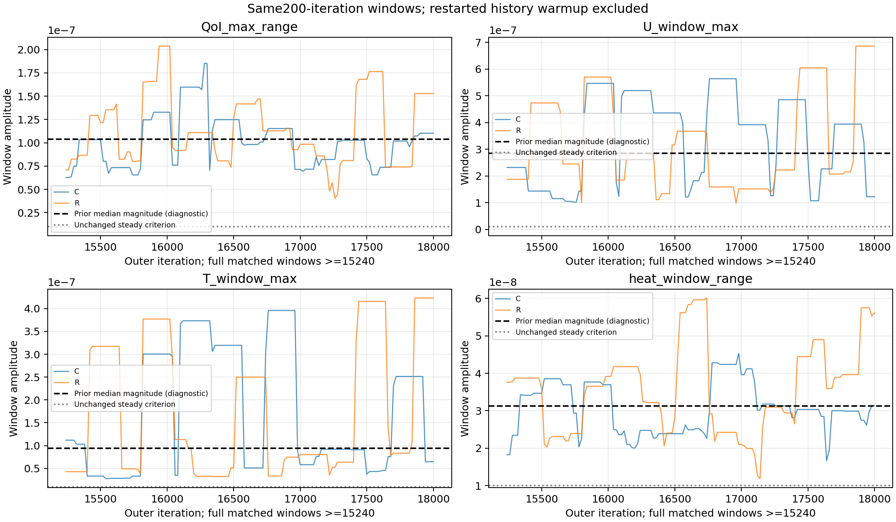

# Restart-Effect Controlled Diagnostic

## 1. Purpose

Ra_test=30000,20×20×1,zero source の additional restart at iteration15000 effect のみを分離した。両枝は12000で共通にrestartする。推定対象は15000で追加される restart / write-read / reinitialization bundle であり、restart一般ではない。Diagnostic PASS は対照実験の成立を意味し、steady qualificationやGate GのPASSではない。

## 2. Previous convergence-band evidence

12000–30000のmicrocase qualificationはFAIL、元1e-8条件未達。QoI/heat PLATEAU、U/Tおよびoverall INCONCLUSIVE。formal benchmarkは参照していない。

| iteration | QoI_range | U_change | T_change | heat_range | epsilon_mean |
| --- | --- | --- | --- | --- | --- |
| 12000 | 8.72793346e-08 | 2.27894359e-07 | 1.62709512e-07 | 2.43980188e-08 | 2.27449345e-10 |
| 15000 | 6.41342482e-08 | 1.27373510e-07 | 3.23933023e-08 | 3.24071505e-08 | 3.39869682e-10 |
| 18000 | 1.52747299e-07 | 6.86192778e-07 | 4.23200220e-07 | 5.62250082e-08 | 4.28791874e-10 |
| 24000 | 1.38887031e-07 | 3.00979973e-07 | 2.98735813e-07 | 3.08747491e-08 | 1.89618197e-10 |
| 30000 | 1.12171970e-07 | 3.15267549e-07 | 1.36858716e-07 | 3.19479851e-08 | 2.10610090e-10 |

## 3. Amendment and hashes

実行前に固定し、各call前/分析後に確認。JSON `e649e5c87a4cf0af3b339eb43eaccce0dd7d2b5845c52484cd63013ec15cc1fb`、MD `e310990d1d5f3831f83df825c791f4846813280418bd1e54b0eaac3bf194e4ee`。v1/001および既存results不変。driver/analysis/startup digestと正確な既存band参照値はamendment002 JSONに記録。開始HEAD `769a7ae274266e511ab21931ae8becd9d1d55a0c`。開始/終了git statusとdiff statはrestart_provenance.jsonに保存。git add/commit/pushは実行していない。最終tracked diffは空で、新規diagnostic以外のtracked変更はない。

## 4. Common 12000 parent

前回保存された全12000 treeのdigestと一致し、両枝開始stateも完全一致。alphat/p/uniform/timeを含む。mesh/physics/source/system/case manifestも確認。元caseは不変。

| file | sha256 |
| --- | --- |
| U | 1e319f4661afed3992a6be31f954effd3b7a49582e5552380063da01995349fe |
| alphat | e29fe1c6dddb9eb38423349801b4d71a8ae5f21aa25d800bc26798fbd46f12db |
| phi | b221f60d0bcd87a4f684f530cd619ed0c31ae1d21c02341e695ee14f5c7f6801 |
| T | ba8484010268a9dae6c869a4cc20fe28f16a47855a1b763fbee0d402201c28f3 |
| p | 9a08968b558df1d5d259c2642c6e722d8bfbefc5b18f7dac3fa22baeb20d3725 |
| p_rgh | f22af178a878ad88fca991483f8aac68f9af46171ee69332f80cfc41628a3dc3 |
| uniform/time | 906fbe54ab7952035b4fca38bf552537e5329585befa9faaa3e8834b5a930d5d |

## 5. Branch C continuous design

12000→18000は単一process。15000でprocessを終了していない。標準writeInterval20/purgeWrite14を維持し、stdoutのwrite完了後ExecutionTimeを受けてfieldを外部ignored archiveへcopy。15000–18000全151時点の実fieldを保存し、field reconstructionは行っていない。

## 6. Branch R restart design

12000→15000正常終了。その全保存stateからfresh processで15000→18000。第一segmentのmonitor/audit/sourceCells/logは第二processによる上書き前に外部保存。

| branch | start | end | pid | normal_exit | exit_code |
| --- | --- | --- | --- | --- | --- |
| R | 12000 | 15000 | 337708 | True | 0 |
| C | 12000 | 18000 | 337709 | True | 0 |
| R | 15000 | 18000 | 337711 | True | 0 |

## 7. Numerical settings equivalence

p1e-10、U/T1e-12、relTol0、relaxation、fvSchemes/fvSolution、physics、BC、zero source、mesh、solver source/binary、monitor/QoI/steady criteriaは不変。変更は新copyのstartFrom latestTime/endTimeのみ。各callの前後input/controlDict/binary digestを記録。binary SHA256 `b3696687e1fbea626916c857215e0654a0c7b710a6a8115811486af1afe7c904`。stock equivalenceを再実行していない。

## 8. 15000 pre-restart equivalence

BITWISE_IDENTICAL。C15000 writeをprocess継続中にR15000と比較してguardを通過。数値payloadにはinternal/physical boundary値とpressure gradient、empty patch型を含む。zeroGradientの暗黙値は共通mesh owner値から抽出しoriginを記録。

| field | raw_identical | payload_identical | values_exactly_equal |
| --- | --- | --- | --- |
| U | True | True | True |
| T | True | True | True |
| p_rgh | True | True | True |
| phi | True | True | True |

完全digestはfield_hash_comparison.csv、canonicalizationは実行前amendment参照。raw hash不一致の後付け解釈は行っていない。

## 9. Restart execution

R15000正常終了、C15000同等性、Rの15000全restart stateおよび入力不変を確認してから、許可されたendTimeのみ18000に更新し第二processを開始。ちょうど3 solver calls。STOPなし。追加solver実行なしで、R15000/R18000の4 field raw hashが前回qualificationの各checkpointにも完全一致することを確認した。verification_checks.jsonに反復列、window、hash不変性等の検証結果を保存。新case/runのみを使用し、formal data/caseには触れていない。

## 10. 18000 field comparison

Uはvector norm max/RMS、scalarはabsolute max/RMS。internal+physical boundary値を集計し、internal-only/component maxもCSVに保存。p_rgh gradientは別unitsで比較しfield値RMSに混ぜない。全scaleを共通12000から固定：

- U_Up_reference_m_s = 0.0051293067249479985
- T_DeltaT_K = 1.0
- p_rgh_parent_centered_internal_RMS_m2_s2 = 5.64631031820992e-05
- phi_characteristic_face_flux_m3_s = 2.564653362473999e-09
- rule = All scales frozen from common12000: Up=max internal |U|, pscale=centered internal RMS. Same gauge/reference in both branches. Flux=Up*(L/20)*depth.

| field | max_abs_difference | RMS_difference | normalized_max_difference | normalized_RMS_difference | L1_difference | gradient_max_abs_difference |
| --- | --- | --- | --- | --- | --- | --- |
| U | 3.81711688e-10 | 1.17483361e-10 | 7.44177933e-08 | 2.29043353e-08 | null | null |
| T | 1.88053946e-08 | 5.88252938e-09 | 1.88053946e-08 | 5.88252938e-09 | null | null |
| p_rgh | 5.93097099e-12 | 2.01956696e-12 | 1.05041534e-07 | 3.57679059e-08 | null | 7.33653041e-09 |
| phi | 8.39162772e-17 | 2.04673028e-17 | 3.27203194e-08 | 7.98053377e-09 | 1.22768431e-14 | null |

whole-fileとnumerical-payload SHA256はfield_hash_comparison.csv。pressure gaugeは変更していない。phi L1はface differencesの総和でありcell divergence normではない。

## 11. QoI comparison

18000は既存extract関数によるASCII field値。value QoIはabs(R-C)/abs(C)、positionはabsolute nondimensional。4097 samplingの位置不変はsub-grid exact peak不変を証明しない。

| quantity | C_value | R_value | absolute_difference | normalized_difference | difference_to_existing_reference_ratio |
| --- | --- | --- | --- | --- | --- |
| Nu_bar_cavity | 3.29195562e+00 | 3.29195561e+00 | 9.45489065e-09 | 2.87211972e-09 | 1.07765505e-01 |
| Nu_bar_0 | 3.27543009e+00 | 3.27543004e+00 | 5.41635927e-08 | 1.65363299e-08 | 4.68807528e-01 |
| Nu_bar_half | 3.27543001e+00 | 3.27543003e+00 | 1.89401659e-08 | 5.78249751e-09 | 8.87061709e-02 |
| Umax | 2.44521037e+01 | 2.44521044e+01 | 6.68303432e-07 | 2.73311221e-08 | 3.38380084e-01 |
| Wmax | 3.62498474e+01 | 3.62498473e+01 | 1.29979007e-07 | 3.58564288e-09 | 1.05420500e-01 |
| Umax_Z | 8.25195312e-01 | 8.25195312e-01 | 0.00000000e+00 | 0.00000000e+00 | null |
| Wmax_X | 7.49511719e-02 | 7.49511719e-02 | 0.00000000e+00 | 0.00000000e+00 | null |

中間historyは同じnative monitor値。field extraction/native-memoryとの差はbranch_C/R_18000.jsonのserialization_differenceに保存し、restart-induced差と混同しない。

## 12. Continuity comparison

| quantity | C_value | R_value | absolute_difference | relative_difference | difference_to_existing_reference_ratio |
| --- | --- | --- | --- | --- | --- |
| epsilon_phi_mean | 3.55721372e-10 | 4.28791923e-10 | 7.30705514e-11 | 2.05415128e-01 | 2.70602721e-01 |
| epsilon_phi_max | 2.03222691e-09 | 3.62730953e-09 | 1.59508262e-09 | 7.84893955e-01 | 8.79783245e-01 |
| heat_imbalance | 2.21873339e-08 | 2.13769141e-09 | 2.00496425e-08 | 9.03652624e-01 | 6.40179179e-01 |
| net_boundary_flux | -6.20385459e-25 | 2.06795153e-25 | 8.27180613e-25 | 1.33333333e+00 | null |
| absolute_total_wall_flux | 6.20385459e-25 | 2.06795153e-25 | 4.13590306e-25 | 6.66666667e-01 | null |
| closure | -1.29246971e-25 | 2.29413373e-25 | 3.58660344e-25 | 2.77500000e+00 | null |

pressure audit/true residual/Np/mapping、P95/P99、max/meanもCSV/branch final JSONに保存。epsilon参照比は前回absolute levelに対する比で、variation amplitude比とは異なる。新しい保存基準・quotaは導入しない。

## 13. Branch divergence history

15000と、その後15020:20:18000の151 actual-field/monitor時点を比較。U/T max/RMS、7QoI、epsilon/heat差をCSVへ保存。early15020–15200/late17800–18000の集計：

| quantity | description | first_nonzero_iteration | first_after_restart | last | early_median | late_median | late_to_early_median_ratio | increases | decreases |
| --- | --- | --- | --- | --- | --- | --- | --- | --- | --- |
| U | PERSISTENT_IRREGULAR_RESPONSE | 15020 | 5.60453549e-08 | 7.44177933e-08 | 1.36185853e-07 | 8.76000044e-08 | 6.43238652e-01 | 79 | 70 |
| T | PERSISTENT_IRREGULAR_RESPONSE | 15020 | 1.71338570e-08 | 1.88053946e-08 | 2.69147620e-08 | 2.79134724e-08 | 1.03710642e+00 | 70 | 79 |
| max_value_QoI | PERSISTENT_IRREGULAR_RESPONSE | 15020 | 2.61916567e-08 | 2.73311219e-08 | 3.43377411e-08 | 4.20943457e-08 | 1.22589152e+00 | 82 | 67 |
| heat_imbalance | PERSISTENT_IRREGULAR_RESPONSE | 15020 | 2.24400152e-08 | 2.00497467e-08 | 1.35270269e-08 | 1.80120518e-08 | 1.33156028e+00 | 74 | 75 |
| epsilon_phi_mean | PERSISTENT_IRREGULAR_RESPONSE | 15020 | 1.31219163e-11 | 7.30704614e-11 | 1.01827648e-10 | 4.02601336e-11 | 3.95375268e-01 | 74 | 75 |
| epsilon_phi_max | PERSISTENT_IRREGULAR_RESPONSE | 15020 | 7.39223482e-10 | 1.59508000e-09 | 6.11199637e-10 | 5.54968049e-10 | 9.07998002e-01 | 67 | 82 |

非単調な残存responseはasymptotic constant-bandやprimary-causeの証明ではない。

## 14. Continuous-branch variation

同一11 samples/200 iterations、matched15240–18000の139 windows。R15020のU/T初期sentinelと短いhistoryをwindow比較から除外し、Cも同じ期間へ制限。field changeは元native20-step norm/current Up、temperatureはDeltaT1K。

| quantity | min | median | max | P95 | median_to_prior_reference_ratio |
| --- | --- | --- | --- | --- | --- |
| QoI_max_range | 6.26206509e-08 | 1.02790408e-07 | 1.85121374e-07 | 1.59644720e-07 | 9.89519707e-01 |
| U_window_max | 1.01878960e-07 | 3.94066109e-07 | 5.64094959e-07 | 5.64094959e-07 | 1.38370083e+00 |
| T_window_max | 2.77486265e-08 | 9.21272658e-08 | 3.95852510e-07 | 3.95852510e-07 | 9.81182084e-01 |
| heat_window_range | 1.66265042e-08 | 3.03580364e-08 | 4.53012245e-08 | 4.23774094e-08 | 9.69323156e-01 |
| epsilon_phi_mean | 1.39741550e-10 | 3.12109464e-10 | 4.74394364e-10 | 4.29054196e-10 | null |
| epsilon_phi_mean_window_range | 1.44295487e-10 | 2.30405138e-10 | 3.29904594e-10 | 3.29904594e-10 | null |

Native qualified samples (>=15000): 0。Original steady qualificationは確立していない。

## 15. Restarted-branch variation

同一11 samples/200 iterations、matched15240–18000の139 windows。R15020のU/T初期sentinelと短いhistoryをwindow比較から除外し、Cも同じ期間へ制限。field changeは元native20-step norm/current Up、temperatureはDeltaT1K。

| quantity | min | median | max | P95 | median_to_prior_reference_ratio |
| --- | --- | --- | --- | --- | --- |
| QoI_max_range | 4.04753630e-08 | 1.10933816e-07 | 2.03666486e-07 | 1.76439971e-07 | 1.06791284e+00 |
| U_window_max | 9.76052207e-08 | 2.53134706e-07 | 6.86192778e-07 | 6.86192778e-07 | 8.88842489e-01 |
| T_window_max | 3.21981020e-08 | 8.32554861e-08 | 4.23200220e-07 | 4.23200220e-07 | 8.86695058e-01 |
| heat_window_range | 1.18733176e-08 | 3.65551164e-08 | 6.01311573e-08 | 5.83659627e-08 | 1.16719410e+00 |
| epsilon_phi_mean | 1.30471936e-10 | 3.19179270e-10 | 5.49998872e-10 | 4.37340150e-10 | null |
| epsilon_phi_mean_window_range | 1.28790390e-10 | 2.74480645e-10 | 3.98601504e-10 | 3.98601504e-10 | null |

Native qualified samples (>=15000): 0。Original steady qualificationは確立していない。

## 16. Restart effect relative to observed band

前回late18000/24000/30000の既存amplitude medianの中央値を事前固定。Cross-branch差/within-trajectory variation幅は比較可能な診断scaleだが同じ統計量ではない。positionの既存bandゼロはnull、pressure/phiの既存like-for-like band未保存もnull；後付けfloor/閾値はない。

| quantity | reference | endpoint_ratio | trajectory_median_ratio | trajectory_max_ratio |
| --- | --- | --- | --- | --- |
| U | 2.84791410e-07 | 2.61306313e-01 | 3.12423563e-01 | 1.91445539e+00 |
| T | 9.38941582e-08 | 2.00282903e-01 | 2.78357262e-01 | 4.06848635e+00 |
| max_value_QoI | 1.03879092e-07 | 2.63105131e-01 | 3.43639159e-01 | 1.63870802e+00 |
| heat_imbalance | 3.13187983e-08 | 6.40179179e-01 | 3.62421876e-01 | 1.67855391e+00 |
| epsilon_phi_mean | 2.70028886e-10 | 2.70602721e-01 | 3.27143859e-01 | 1.36919951e+00 |
| epsilon_phi_max | 1.81304046e-09 | 8.79783245e-01 | 4.06996770e-01 | 3.22640826e+01 |
| Nu_bar_cavity | 2.66515682e-08 | 1.07765505e-01 | null | null |
| Nu_bar_0 | 3.52731749e-08 | 4.68807528e-01 | null | null |
| Nu_bar_half | 6.51870941e-08 | 8.87061709e-02 | null | null |
| Umax | 8.07704808e-08 | 3.38380084e-01 | null | null |
| Wmax | 3.40127669e-08 | 1.05420500e-01 | null | null |
| Umax_Z | 0.00000000e+00 | null | null | null |
| Wmax_X | 0.00000000e+00 | null | null | null |
| p_rgh | null | null | null | null |
| phi | null | null | null | null |

## 17. Interpretation

Restart effect class=DETECTED。15000までは同一で18000は数値差があるかを判定した。Continuous branch median QoI window range=1.02790408e-07、前回reference=1.03879092e-07、ratio=0.98952。事前登録されたnearest-decimal-orderの記述分類でband残存=True。これはacceptance thresholdではない。追加15000 restartをbandの必要条件とする仮説=NOT_SUPPORTED（この期間/ケースのみ）。Primary cause=INCONCLUSIVE。Bundleは軌道に寄与しうるが、既存bandの原因寄与率はこの差/reference比から求められない。

## 18. What is NOT concluded

Serialization単独/reinitialization単独への分解、restart一般の全影響、12000共通restartの影響、primary cause、linear precisionの因果、exact/truth solution、他Ra/grid、scientific acceptance、quota/tau、新steady criterion、Candidate B正式化、formal Gate再評価は結論しない。共通12000 restartから6000 iterationsのfinite trajectoryであり、long-term independent distributionsを比較していない。Candidate B PROVISIONAL、formal Ra1e3 Gate G FAILは既存状態の宣言。formal結果は使用していない。

## 19. Next decision

このrestart診断で停止。次は別taskで、single-factor solver-tolerance studyを事前設計するかをユーザーが決める。今回p/U/T tolerance・relaxationは変更せず、Arm1/Arm2を再開していない。Quota/tau UNRESOLVED、SPEC_CHANGE_EXECUTED=NO、USER_DECISION_REQUIRED=YES。
